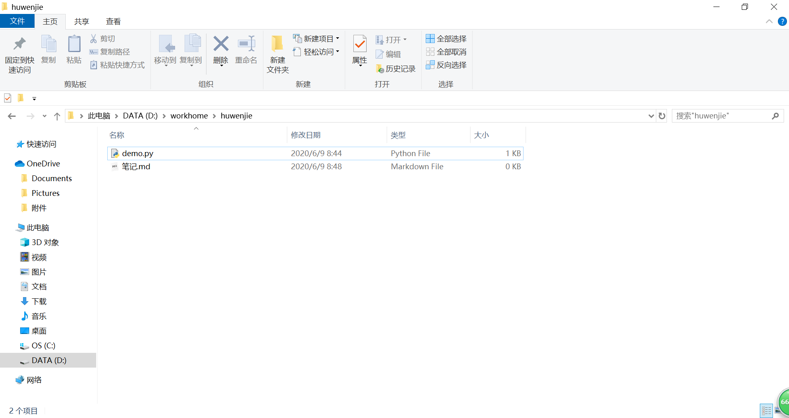

# VSCode的学习和应用
## python
python文件的后缀名是.py
```py
print（"hello world")
```
## markdown
"一个#代表一级标题"
“----代表分割线”
## 流程图
流程图的后缀是.dio

## mysql
## 图片
粘贴图片 ctrl+alt+v


## git的配置
注册github
安装git
VSCodeの设置里弄好git的路径
在git bash里做好设置
同步github


